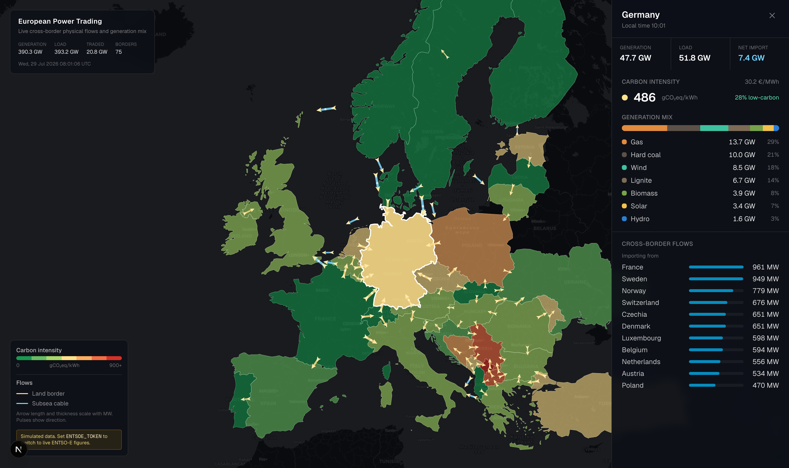
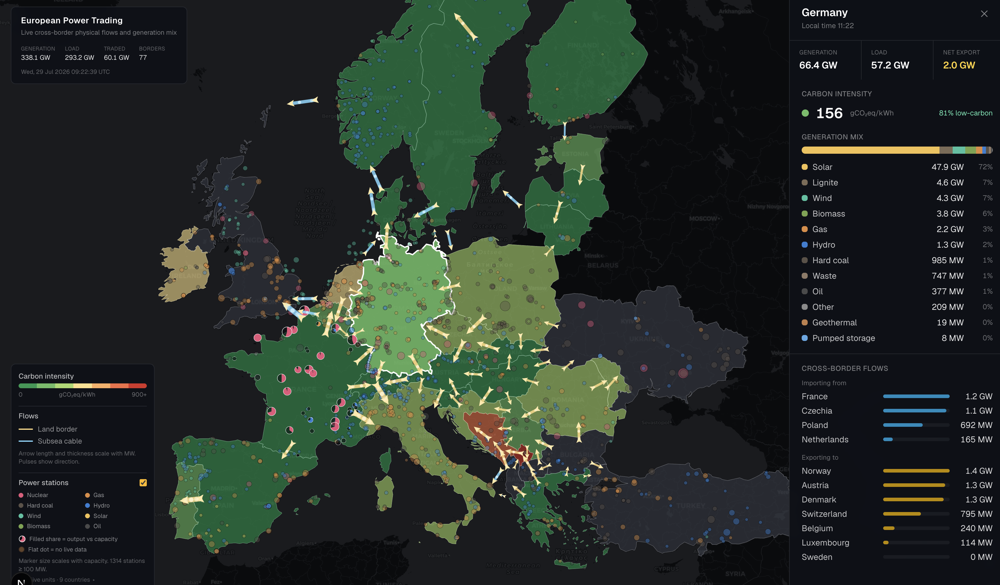

# European Power Trading Map

**[Live map → t2o2.github.io/eu-energy-trading-map](https://t2o2.github.io/eu-energy-trading-map/)**

Live cross-border electricity flows across Europe. Countries are shaded by the
carbon intensity of what they are generating right now, and every interconnector
carries an animated arrow whose direction, length and thickness show where power
is moving and how much. A toggleable layer plots every power station of 100 MW
and above, with live output where its TSO publishes it.

A time slider scrubs back through the last 24 hours — press play to watch solar
ramp up across the continent, the evening peak bite, and flows reverse as prices
move. Arrow keys step an hour at a time, space toggles playback.



Pies show output against nameplate capacity; flat dots are stations whose TSO
publishes no per-unit figures.



## Running

```bash
npm install
npm run snapshot  # fetch 24h of grid data into public/data/snapshot.json
npm run dev
```

Open <http://localhost:3000>. With no API token the app serves realistic
simulated data, so it works immediately.

For real figures, register at <https://transparency.entsoe.eu>, then email
`transparency@entsoe.eu` from the registered address with subject "Restful API
access" (approval is manual). Put the token in `.env.local`:

```bash
cp .env.example .env.local   # then paste your token into ENTSOE_TOKEN
```

## How it works

**Data.** `GridSource` (`src/lib/sources/source.ts`) has two implementations,
`MockSource` and `EntsoeSource`, keyed on ENTSO-E EIC area codes rather than ISO
country codes so moving to bidding-zone level later is a data change, not a
rewrite. `EntsoeSource` issues four queries per country and two per border —
about 300 requests per refresh against a 400/minute limit, so they run through a
concurrency limit of 10. Partial failures land in `GridSnapshot.degraded` rather
than failing the whole snapshot.

**History.** The slider's 24 hourly frames are free: each ENTSO-E query already
returns the whole requested period, and the old code kept only the newest point.
`valueAt(series, instant)` replays one response at any instant, so a day of
history costs exactly as many requests as a single reading did — only the stored
payload grows (~290 KB gzipped, mostly per-unit plant output). The mock is a
pure function of time, so it generates history the same way.

**Geometry.** `npm run geo` precomputes `public/geo/countries.json` (Natural
Earth 1:50m polygons, clipped to the European view) and `borders.json` (one
anchor point and bearing per border). Anchors sit on the *shared boundary
segment* between two countries, found by densifying one outline and keeping the
vertices within tolerance of the other; where two countries meet along several
stretches the longest run wins. Subsea cables with no shared land boundary
(NorNed, Viking Link, NordBalt) fall back to the midpoint of the shortest line
between coastlines, and a separation pass slides apart anchors that would
otherwise stack up in the Dover Strait. 65 land borders, 15 subsea cables, no
hand-curated coordinates.

**Power stations.** `npm run plants` precomputes the 1,314 stations of 100 MW and
above from the WRI Global Power Plant Database (CC-BY 4.0). A station with
matched live output is drawn as a **pie** (filled wedge = output as a share of
nameplate); one without is a **flat, dimmed dot**, because drawing it at 0%
would assert it is idle, which we do not know.

Matching live output is the hard part: ENTSO-E publishes per-unit generation
keyed on unit EIC codes with no coordinates, WRI publishes coordinates with no
EIC codes. With no shared key, `joinLiveOutput` matches on normalised station
names within an area — stripping diacritics, corporate suffixes and trailing unit
designators, so `CATTENOM 3` aggregates onto `Cattenom`. The match is
deliberately strict; a loose match would attach one station's output to
another's location. Against live French data it matches 21 of the 23 stations
above 1000 MW and 84% of mapped capacity.

**Rendering.** MapLibre GL with a CARTO raster basemap (no API key). Countries
are a fill layer coloured through `feature-state`; flows are a line layer plus an
arrowhead symbol layer, with travelling pulses updated each animation frame.

## Deployment

Static export on GitHub Pages — no server. Grid data is fetched at build time
into `public/data/snapshot.json` and shipped as a plain file;
`.github/workflows/deploy.yml` rebuilds hourly on a cron.

To host your own copy: set Settings → Pages → Source to **GitHub Actions**, add
`ENTSOE_TOKEN` under Settings → Secrets and variables → Actions, then push to
`main`. GitHub's cron is best-effort and often late, so data can be an hour or so
stale; the UI always shows the snapshot's own timestamp.

## Notes

- Arrows show **physical** flows. Scheduled commercial exchanges differ because
  of loop flows.
- Per-unit output is published by only a minority of TSOs — France reports ~150
  units, Germany none — so ring markers cluster in a few countries. Upstream
  coverage, not a bug.
- The plant list is a 2021 snapshot, so stations commissioned or retired since
  are missing. WRI does not distinguish lignite from hard coal.
- Countries with several bidding zones (Norway, Sweden, Denmark, Italy) are shown
  aggregated, so intra-country congestion is not visible.
- Carbon intensities are IPCC AR5 lifecycle medians applied to the live mix.
- Pinned to `maplibre-gl` 5.24.0: in 6.0.0 `GeoJSONSource.setData` silently fails
  to populate the source and nothing renders.

## Scripts

| command | purpose |
| --- | --- |
| `npm run dev` | development server |
| `npm run build` | production build |
| `npm run snapshot` | fetch 24h of grid data into `public/data/snapshot.json` |
| `npm run geo` | rebuild map geometry from Natural Earth (~90s, output committed) |
| `npm run plants` | rebuild power station locations from WRI GPPD (output committed) |
| `npm run typecheck` | TypeScript, no emit |
| `npm run lint` | ESLint |
